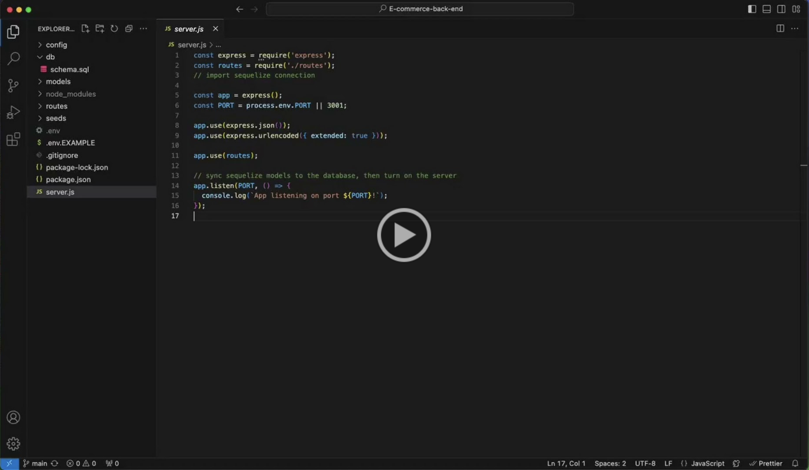

# E-commerce-Back-End

[](https://opensource.org/licenses/MIT)

## Description

This repo was created to build the back-end for an e-commerce site. A working Express.js API was taken and configured to use Sequelize to interact with MySQL database. A demo video can be found in the [Demo](#demo) section

## Table of Contents

- [Installation](#installation)
- [Usage](#usage)
- [Demo](#demo)
- [Credits](#credits)
- [License](#license)
- [How to Contribute](#how-to-contribute)

## Installation

This application needs npm to be installed and saved

```bash
npm i
```

## Usage

To create database:

```bash
$ mysql -u root -p
```

Then enter MySQL credentials and then run the schema file as shown below

```bash
mysql> SOURCE schema.sql
```

Create a .env file with the variables shown in the example file (.env.EXAMPLE). Make sure the new .env file is in your .gitignore file, since it will contain your MySQL password

Before starting the server, the database needs to be seeded by:

```javascript
$ npm run seed
```

Start the server by:

```javascript
$ npm start
```

## Demo

The following video shows how to start the database, seed it, and run the server. Additionally, it shows the routes created through Insomnia-core

[](https://drive.google.com/file/d/1BxdxN2o-kcMy4b_O17qBCYaR16ObamZc/view)

## Credits

N/A

## License

This application is covered under [MIT](https://choosealicense.com/licenses/mit/) license

## How to Contribute

If you have any questions, comments, or concerns please feel free to reach me at beatz.bravo@gmail.com. If you would like to contribute to my project, you can find my repo on [github.com/Beabravo](https://www.github.com/Beabravo)
